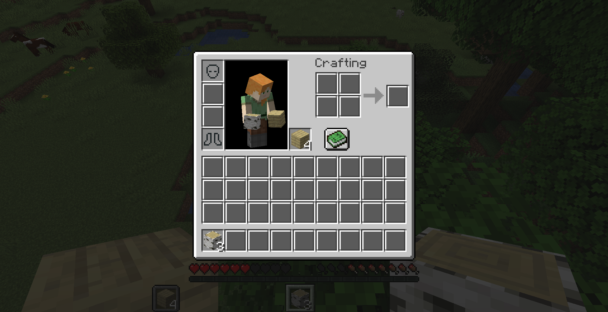

# Locki



A [Quilt](https://quiltmc.org) library handling player inventory locking. Can also be used as a standalone mod, through the `/locki` command.

This mod must be installed on both server and client to work properly.

## Overview

Locki represents slots using *inventory nodes*. Inventory nodes are structured as a tree, allowing commands
or mods to quickly lock or unlock entire sections while retaining controls over finer units.
Inventory nodes are represented as a dot-separated path, from least specific ancestor to most specific child node.
For example `inventory` describes the entirety of the player's inventory, while `inventory.armor.chest`
describes the chestplate slot of the inventory.

When an inventory node gets locked, descendant nodes can still be unlocked, allowing you to exclude specific slots
from a broad access ban. For example, locking `inventory` then unlocking `inventory.armor.chest` will prevent the player
from touching any item in their inventory except their chestplate.

### Commands
Locki adds the `/locki` command, allowing server operators and mapmakers to interact with the API through
commands.
- `/locki lock <node> [<targets>] [<lock>]` : locks the inventories of one or more players
    - `<node>` : a full path describing a known *inventory node*.
    - `[<targets>]` (optional) : If specified, must be either a player's username or a target selector. If unspecified, defaults to the player using the command. When used in a command block, player is not optional.
    - `[<lock>]` (optional) : If specified, must be a valid identifier referencing a registered lock. If unspecified, defaults to the generic "command" lock.
- `/locki unlock <node> [<targets>] [<lock>]` : unlocks the inventories of one or more players
    - `[<targets>]` (optional) : If specified, must be either a player's username or a target selector. If unspecified, defaults to the player using the command. When used in a command block, player is not optional.
    - `[<lock>]` (optional) : If specified, must be a valid identifier that was previously used as a lock to affect the players' inventories. If left unspecified, defaults to the generic "command" lock.

#### Permissions
If you have LuckPerms installed, the above commands can be used by players with the `locki.command.lock` permission.
If you only grant `locki.command.lock.self`, players will only be able to use the commands on themselves.

## Using Locki (for developers)

### Interfacing with Locki through Fabric Permissions API

```java
if (Permissions.check(player, "locki.access.inventory.armor.head", true)) {
    // nothing is locking the head slot
}
```
For a list of default inventory nodes, see [DefaultInventoryNodes.java](src/main/java/io/github/ladysnake/locki/DefaultInventoryNodes.java).
Simply prepend the desired node's full path with `locki.access.` before checking.

### Adding Locki to your project

You can add the library by inserting the following in your `build.gradle` :



[- groovy -]
`gradle.properties`:
```properties
# Locki
locki_version = <LOCKI_VERSION>
# Fabric Permissions API
fpa_version = 0.2-SNAPSHOT
# Cardinal Components
cca_version = <CCA_VERSION>
```

`build.gradle`:
```gradle
repositories {
	maven { 
        name = "Ladysnake Mods"
        url = "https://maven.ladysnake.org/releases"
        content {
            includeGroup 'io.github.ladysnake'
            includeGroup 'org.ladysnake'
            includeGroupByRegex '(dev|io\\.github)\\.onyxstudios.*'
        }
    }
    maven {
        name = "Nexus Repository Manager"
        url = 'https://oss.sonatype.org/content/repositories/snapshots'
    }
}

dependencies {
    modImplementation "org.ladysnake:locki:${locki_version}"
    include "org.ladysnake:locki:${locki_version}"
    // locki dependencies
    include "me.lucko:fabric-permissions-api:${fpa_version}"
    include "dev.onyxstudios.cardinal-components-api:cardinal-components-base:${cca_version}"
    include "dev.onyxstudios.cardinal-components-api:cardinal-components-entity:${cca_version}"
}
```

[- kts -]
`gradle.properties`:
```properties
# Locki
locki_version = <LOCKI_VERSION>
# Fabric Permissions API
fpa_version = 0.2-SNAPSHOT
# Cardinal Components
cca_version = <CCA_VERSION>
```

`build.gradle.kts`:
```kotlin
repositories {
    maven {
        name = "Ladysnake Mods"
        url = "https://maven.ladysnake.org/releases"
        content {
            includeGroup("io.github.ladysnake")
            includeGroup("org.ladysnake")
            includeGroupByRegex("""dev\.onyxstudios.*""")
        }
    }
    maven {
        name = "Nexus Repository Manager"
        url = "https://oss.sonatype.org/content/repositories/snapshots"
    }
}

dependencies {
    val lockiVersion = property("locki_version") as String
    val ccaVersion = property("cca_version") as String
    val fpaVersion = property("fpa_version") as String
    modImplementation("org.ladysnake:locki:${locki_version}")
    include("org.ladysnake:locki:${locki_version}")
    // Locki dependencies
    include("me.lucko:fabric-permissions-api:${fpa_version}")
    include("dev.onyxstudios.cardinal-components-api:cardinal-components-base:${cca_version}")
    include("dev.onyxstudios.cardinal-components-api:cardinal-components-entity:${cca_version}")
}
```

[- catalogue -]
`libs.versions.toml`:
```toml
[versions]
locki = '<LOCKI_VERSION>'
cardinalComponentsApi = '<CCA_VERSION>'
fabricPermissionsApi = '0.2-SNAPSHOT'

[libraries]
cca-base = { module = "dev.onyxstudios.cardinal-components-api:cardinal-components-base", version.ref = "cardinalComponentsApi" }
cca-entity = { module = "dev.onyxstudios.cardinal-components-api:cardinal-components-entity", version.ref = "cardinalComponentsApi" }
fpa = { module = "me.lucko:fabric-permissions-api", version.ref = "fabricPermissionsApi" }
locki = { module = "org.ladysnake:locki", version.ref = "locki" }

[bundles]
locki = [ "cca-base", "cca-entity", "fpa", "locki" ]
```

`build.gradle` or `build.gradle.kts`:
```kotlin
repositories {
    maven {
        name = "Ladysnake Mods"
        url = "https://maven.ladysnake.org/releases"
        content {
            includeGroup("io.github.ladysnake")
            includeGroup("org.ladysnake")
            includeGroupByRegex("""dev.onyxstudios.*""")
        }
    }
    maven {
        name = "Nexus Repository Manager"
        url = "https://oss.sonatype.org/content/repositories/snapshots"
    }
}

dependencies {
    // Replace modImplementation with modApi if you expose Locki's interfaces in your own API
    modImplementation(libs.bundles.locki)
    // Includes Locki and its dependencies as a Jar-in-Jar dependency (optional but recommended)
    include(libs.bundles.locki)
}
```


### Using Locki's API

#### Queries

```java
public static boolean isMainHandLocked(PlayerEntity player) {
    return InventoryKeeper.get(player).isLocked(DefaultInventoryNodes.MAIN_HAND);
}
```

#### Modifications

```java
public static final InventoryLock MY_LOCK = Locki.registerLock("mymod", "awesome_feature");

public static void toggleInventoryExceptHands(PlayerEntity player) {
    if (MY_LOCK.isLocking(player, DefaultInventoryNodes.INVENTORY)) {
        MY_LOCK.unlockInventory(player);    // equivalent to unlock(player, DefaultInventoryNodes.INVENTORY)
    } else {
        MY_LOCK.lockInventory(player);      // equivalent to lock(player, DefaultInventoryNodes.INVENTORY)
        MY_LOCK.unlock(player, DefaultInventoryNodes.HANDS);
    }
}
```

